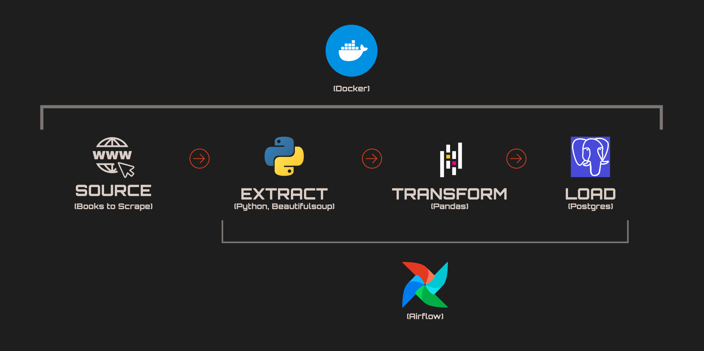

# Data Engineering Pipeline: Book Scraper & PostgreSQL ETL

## 📖 Summary

This project demonstrates a production-ready ETL (Extract, Transform, Load) pipeline designed to automate the collection and storage of market data. By orchestrating a containerized environment with Apache Airflow 3.0, the pipeline extracts real-time product data, transforms it into a structured format using Pandas, and loads it into a PostgreSQL data warehouse.

This architecture solves the manual overhead of data collection and ensures data consistency for downstream analytics.

## 🏗️ System Architecture

The pipeline is built on a Modular Microservices Architecture using Docker, ensuring that each component—orchestration, database, and execution—is isolated and scalable.
Technical Components:

  - Orchestrator: Apache Airflow 3.1 (utilizing the Celery Executor for parallel task processing).

  - Data Source: Web-based product catalog (HTML/HTTP).

  - Processing Engine: Python 3.12 (BeautifulSoup4 for parsing, Pandas for data structuring).

  - Data Warehouse: PostgreSQL 16.

  - Infrastructure: Docker Compose (multi-container environment).

## 🔄 Pipeline Workflow Design
### 1. Extraction Layer

The pipeline initiates an automated web crawl of targeted product catalogs.

  - Protocol: HTTP/HTTPS GET requests with customized headers to simulate browser fingerprints.

  - Parsing: HTML DOM traversal to isolate specific metadata including product titles, price points, and user ratings.

  - Pagination: Dynamic URL parameter handling to navigate multi-page search results.

### 2. Orchestration & State Management

  - Task Isolation: The pipeline is broken into modular tasks (fetch, create, insert) to ensure fault tolerance.

  - Data Passing: Employs Airflow XComs to move structured metadata between the Python execution environment and the SQL loading layer.

  - Concurrency: Configured with the Celery Executor to support parallel task execution within the Docker network.

### 3. Transformation & Loading (ETL)

  - Data Processing: Raw strings are converted into structured formats, handling currency symbols and categorical rating conversions via Pandas.

  - Database Integration: Utilizing the PostgresHook, the pipeline performs batch inserts into a persistent storage layer.

  - Schema Enforcement: Automated DDL execution ensures the destination table is pre-configured with correct data types (SERIAL, TEXT, INTEGER) and primary key constraints.
